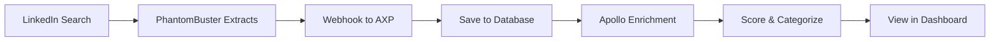

# PhantomBuster Setup Guide for AXP Prospect Tracking

## Overview
This guide walks you through setting up PhantomBuster to automatically find EOS prospects on LinkedIn and send them to your AXP database.

## Prerequisites
- LinkedIn Sales Navigator account ($99/month)
- PhantomBuster account ($30-56/month)
- Apollo.io API key ($149/month)
- AXP admin access

## Step 1: Environment Setup

Add these to your backend `.env` file:

```env
# Apollo for enrichment
APOLLO_API_KEY=your_apollo_api_key

# Webhook security (optional, defaults to 'axp-webhook-secret-2024')
PROSPECT_WEBHOOK_TOKEN=your-secret-webhook-token
```

## Step 2: PhantomBuster Account Setup

1. **Sign up** at https://phantombuster.com
2. **Choose plan**: Start with Starter ($30/month, 5 hours execution time)
3. **Get your API key** from Settings → API

## Step 3: Configure LinkedIn Sales Navigator Search Export

1. **Add the Phantom**:
   - Go to Phantom Store
   - Search for "Sales Navigator Search Export"
   - Click "Use this Phantom"

2. **Connect your LinkedIn account**:
   - Click "Connect to LinkedIn"
   - Use the browser extension method (most reliable)
   - Enter your LinkedIn credentials

3. **Configure Search Parameters**:

```javascript
// Example search URLs for EOS prospects:

// Companies with Integrator roles
https://www.linkedin.com/sales/search/people?keywords=integrator&viewAllFilters=true

// Companies mentioning EOS
https://www.linkedin.com/sales/search/companies?keywords=EOS%20entrepreneurial%20operating%20system

// Companies with L10 meetings
https://www.linkedin.com/sales/search/companies?keywords=L10%20meetings%20rocks

// Growing companies (10-250 employees)
https://www.linkedin.com/sales/search/companies?companySize=C%2CD%2CE&keywords=scaling
```

4. **Phantom Settings**:
   - **Search URL**: Paste your Sales Navigator search URL
   - **Number of results**: 100 per run
   - **Extract emails**: Yes (if available)
   - **Extract company info**: Yes

## Step 4: Set Up Webhook to AXP

1. **In PhantomBuster**, go to your phantom's settings
2. **Add Webhook URL**:

```
Production:
https://api.axplatform.app/api/v1/prospects/webhooks/phantombuster?token=your-secret-webhook-token

Testing (local):
https://your-ngrok-url.ngrok.io/api/v1/prospects/webhooks/phantombuster?token=your-secret-webhook-token
```

3. **Webhook Settings**:
   - Method: POST
   - Send on: Every phantom run
   - Include all data: Yes

## Step 5: Schedule Automatic Runs

1. **Set Launch Schedule**:
   - Click "Schedule" in phantom settings
   - Recommended: Daily at 9 AM
   - Or: Every 12 hours for more frequent updates

2. **Rate Limits** (Important!):
   - Max 100 profiles per run
   - Wait 10-15 seconds between actions
   - Daily limit: 500 profiles total

## Step 6: Data Flow

Here's what happens automatically:



## Step 7: Test the Integration

1. **Manual Test Run**:
   ```bash
   # In PhantomBuster, click "Launch" manually
   # Watch the console for results
   ```

2. **Check AXP Database**:
   ```bash
   # Check if prospects were received
   curl https://api.axplatform.app/api/v1/prospects \
     -H "Authorization: Bearer YOUR_TOKEN"
   ```

3. **View in Dashboard**:
   - Navigate to `/prospects` in AXP
   - You should see new prospects appearing

## Example PhantomBuster Output Format

PhantomBuster sends data in this format:

```json
{
  "data": [
    {
      "companyName": "Tech Solutions Inc",
      "companyUrl": "https://linkedin.com/company/tech-solutions",
      "employeeCount": "51-200",
      "industry": "Software",
      "headline": "Implementing EOS for rapid growth",
      "jobTitle": "Integrator",
      "website": "techsolutions.com"
    }
  ],
  "phantom": "sales-navigator-search-export",
  "runId": "abc123"
}
```

## AXP Processing

When AXP receives the webhook:

1. **Parses LinkedIn data** for EOS signals
2. **Checks for duplicates** by company name
3. **Creates prospect record** with initial score
4. **Triggers Apollo enrichment** to get:
   - Revenue data
   - Full employee count
   - Technology stack (detects Ninety.io, Bloom Growth!)
   - Decision maker contacts with emails
5. **Calculates final score**:
   - Using competitor: +10 points
   - Has Integrator role: +8 points
   - Right size (10-250): +5 points
6. **Categorizes as Hot/Warm/Cold**

## Advanced Searches

### Find Competitor Users
```
site:linkedin.com/company ("ninety.io" OR "bloom growth" OR "traction tools")
```

### Find Recent EOS Adopters
```
keywords: "recently implemented EOS" OR "new to traction" OR "starting our EOS journey"
datePosted: past-month
```

### Find Growing Companies
```
companyHeadcount: 10-250
companyGrowthRate: >20%
keywords: scaling OR growth OR expansion
```

## Monitoring & Troubleshooting

### Check Webhook Logs
```bash
# In your backend logs
tail -f logs/webhooks.log | grep phantombuster
```

### Common Issues

**"No data received"**
- Check PhantomBuster console for errors
- Verify webhook URL is correct
- Check token in webhook URL matches .env

**"LinkedIn rate limit"**
- Reduce results per run to 50
- Increase delay between actions
- Run less frequently

**"Duplicates appearing"**
- Normal - system updates existing prospects with new signals
- Check `prospect_signals` table for history

## Daily Workflow

1. **Morning (9 AM)**: PhantomBuster runs automatically
2. **9:15 AM**: Prospects appear in AXP database
3. **9:30 AM**: Apollo enrichment completes
4. **10 AM**: Review hot prospects in dashboard
5. **Afternoon**: Outreach to qualified prospects

## Costs Breakdown

- LinkedIn Sales Navigator: $99/month
- PhantomBuster Starter: $30/month
- Apollo.io: $149/month
- **Total: $278/month**

**ROI**: Each plan finds ~500 prospects/month. 1-2 conversions pays for everything.

## API Endpoints for Manual Control

```bash
# Manually trigger enrichment
POST /api/v1/prospects/enrich

# Import CSV manually
POST /api/v1/prospects/webhooks/csv-import

# Get today's summary
GET /api/v1/prospects/summary/daily
```

## Next Steps

1. Set up email sequences for hot prospects
2. Create Slack alerts for new hot prospects
3. Build comparison dashboard for tracking conversion rates

---

Your PhantomBuster → AXP pipeline is now ready! Prospects will flow automatically from LinkedIn to your dashboard, fully enriched and scored.