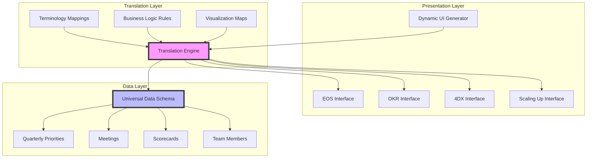
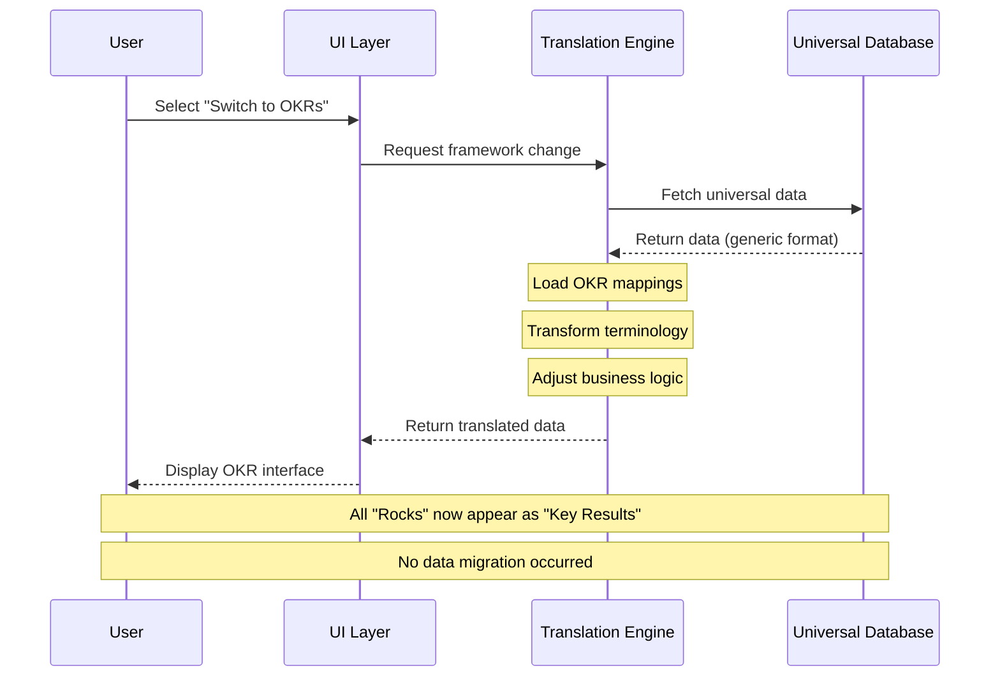
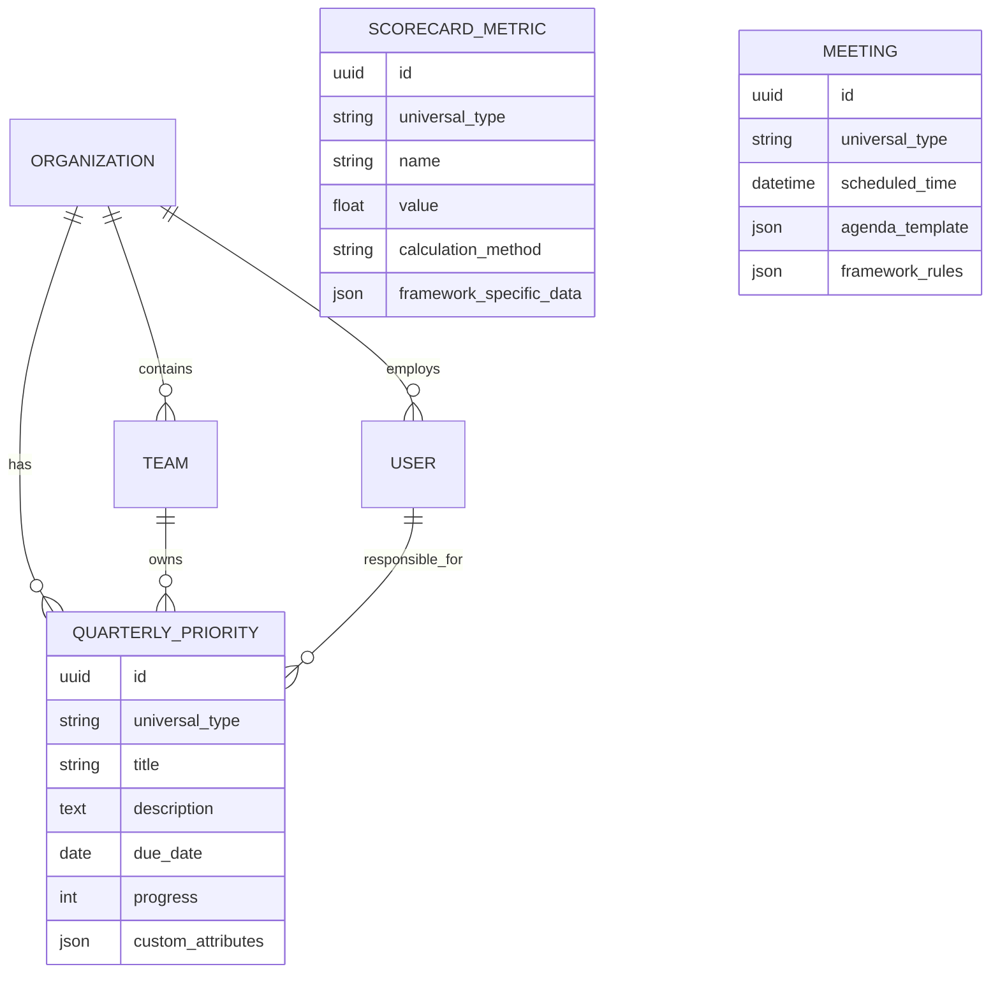
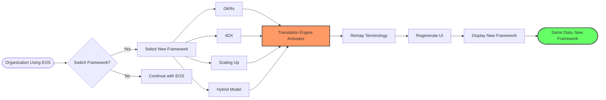
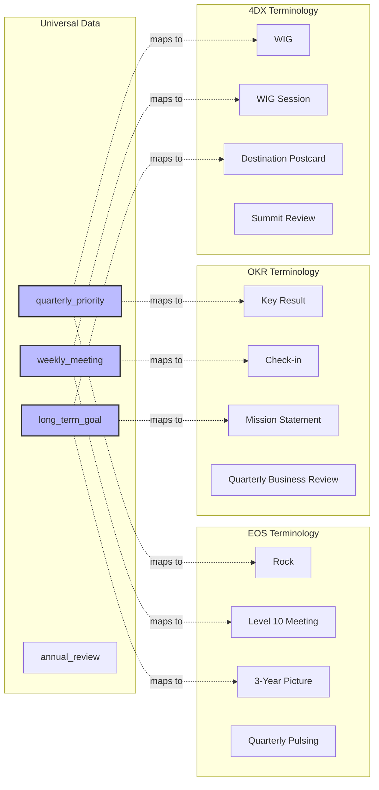
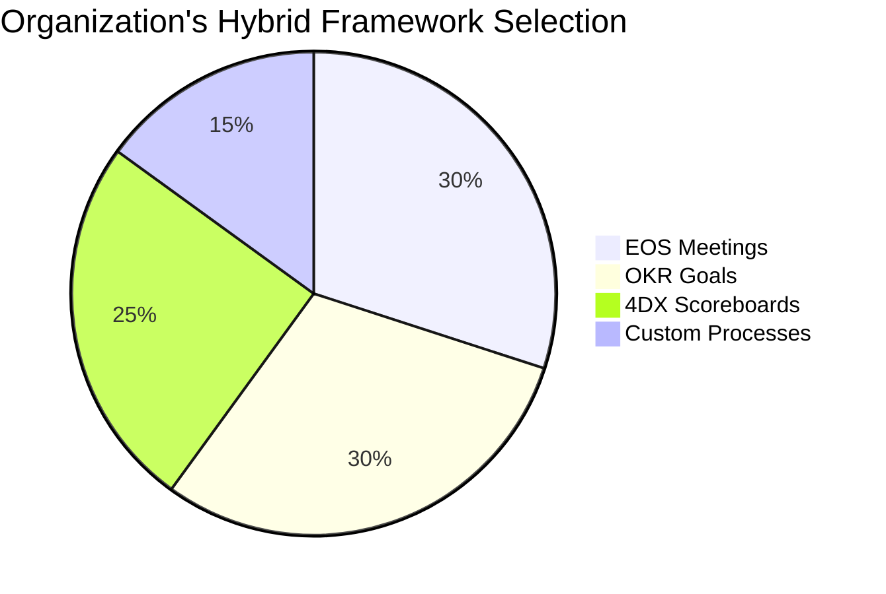
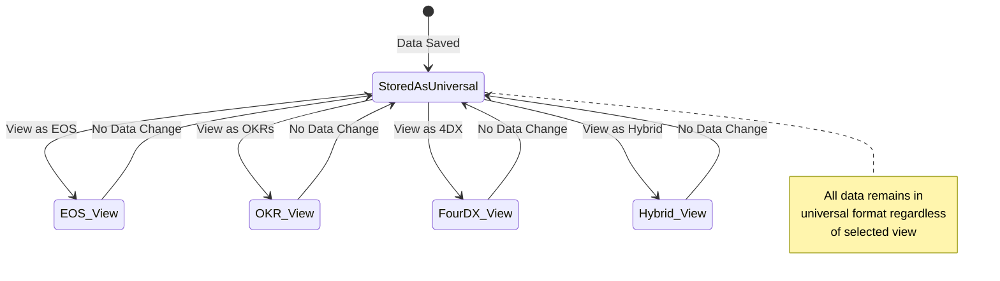
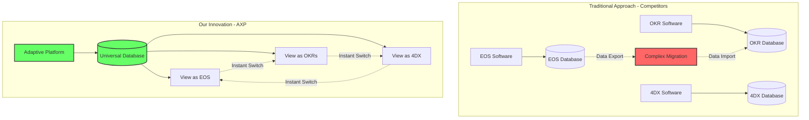
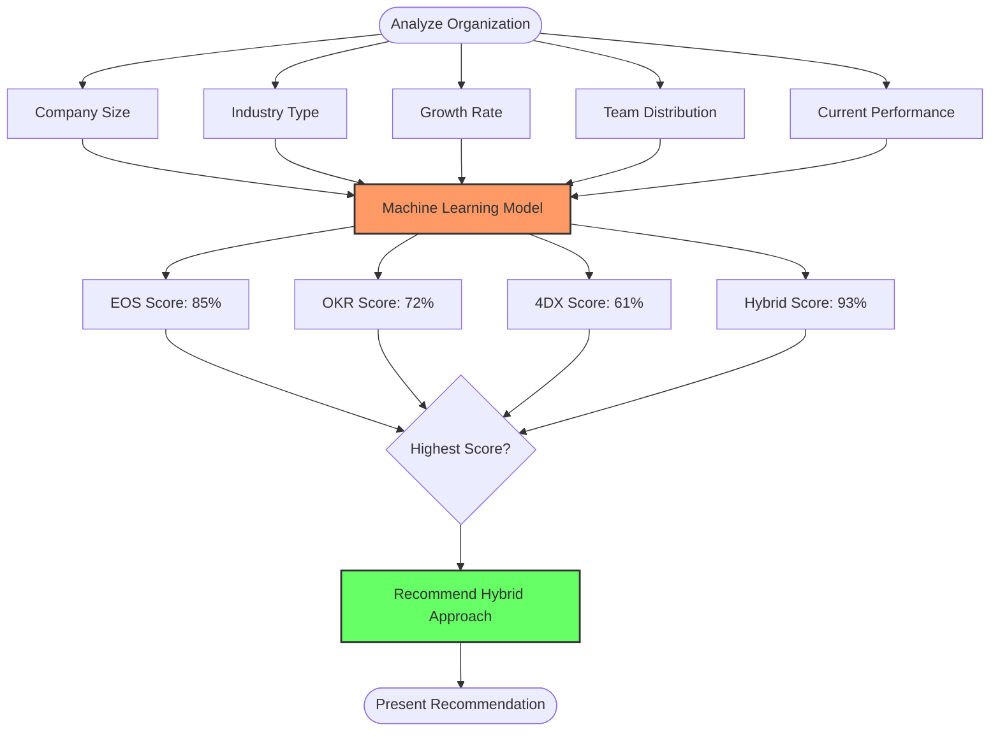
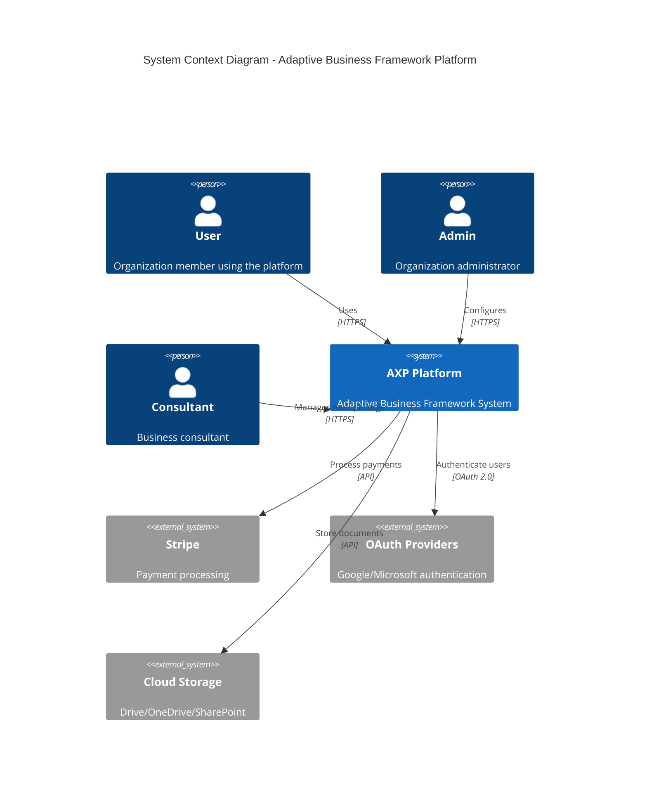

# Patent Diagrams for Adaptive Business Framework Platform

## How to Use These Diagrams
1. Go to https://mermaid.live (free online editor)
2. Copy each diagram code below
3. Paste into the editor
4. Export as PNG or SVG
5. Include in your patent application

---

## Figure 1: System Architecture Overview

---

## Figure 2: Framework Translation Process

---

## Figure 3: Universal Data Model

---

## Figure 4: Framework Switching Flow

---

## Figure 5: Terminology Mapping Example

---

## Figure 6: Hybrid Framework Configuration

---

## Figure 7: Data Flow During Framework Switch

---

## Figure 8: Competitive Advantage Illustration

---

## Figure 9: Algorithm Flow - Framework Recommendation

---

## Figure 10: System Components Integration

---

## Instructions for Creating Additional Diagrams

### Using Mermaid Live Editor:
1. Visit https://mermaid.live
2. Copy any diagram code above
3. Paste and modify as needed
4. Export as PNG with white background
5. Name as Figure_1.png, Figure_2.png, etc.

### Alternative Free Tools:
- **draw.io** (https://app.diagrams.net) - Full drawing tool
- **Excalidraw** (https://excalidraw.com) - Hand-drawn style
- **PlantUML** (https://plantuml.com) - Text to diagram
- **Lucidchart** (free tier available)

### Tips for Patent Diagrams:
- Use black lines on white background
- Add figure numbers and titles
- Keep it simple and clear
- Label all important components
- Show data flow with arrows
- Include a legend if using symbols